# Workflow-Driven TDD Flow Diagram

## Complete Flow from Issue Creation to PR

```mermaid
flowchart TD
    Start([User creates GitHub issue]) --> IssueEvent{Event Type?}

    IssueEvent -->|issues.opened| Bootstrap[Bootstrap Flow]
    IssueEvent -->|workflow_dispatch| IterationFlow[Iteration Flow]

    %% Bootstrap Flow (Initial Issue Creation)
    Bootstrap --> RunTests1[Job: run-tests]
    RunTests1 -->|Skip: Initial issue| DeterminePhase1[Job: determine-phase]

    DeterminePhase1 --> CheckBootstrap{IS_INITIAL_ISSUE<br/>= true?}
    CheckBootstrap -->|Yes| SetPhase2Bootstrap[Set Phase 2<br/>Write Failing Tests]
    SetPhase2Bootstrap --> SetOutputs1[Set outputs:<br/>phase=2<br/>should_run_claude=true<br/>should_continue=true]

    SetOutputs1 --> ClaudeCode1[Job: claude-code]
    ClaudeCode1 --> ClaudeWrites1[Claude writes<br/>failing tests]
    ClaudeWrites1 --> ClaudeCommit1[Claude commits<br/>with 'test:' prefix]
    ClaudeCommit1 --> ClaudePush1[Claude pushes<br/>to branch]

    ClaudePush1 --> CheckChanges1{changes_made<br/>= true?}
    CheckChanges1 -->|No| SkipTrigger1[Skip trigger-next-iteration]
    CheckChanges1 -->|Yes| CheckContinue1{should_continue = true<br/>AND phase != 5?}

    CheckContinue1 -->|No| SkipTrigger2[Skip trigger-next-iteration]
    CheckContinue1 -->|Yes| TriggerNext1[Job: trigger-next-iteration]

    TriggerNext1 --> Wait[Wait 10 seconds<br/>for push to complete]
    Wait --> Dispatch[workflow_dispatch<br/>with iteration=2]

    Dispatch --> IterationFlow

    %% Iteration Flow (Subsequent Runs)
    IterationFlow --> RunTests2[Job: run-tests]
    RunTests2 --> CheckTestsExist{Tests exist?}

    CheckTestsExist -->|No| SkipTests[Skip test run]
    CheckTestsExist -->|Yes| RunUnityTests[Run Unity<br/>PlayMode tests]

    RunUnityTests --> CheckCompilation{Compilation<br/>succeeded?}

    CheckCompilation -->|No| ParseNoResults[No test results<br/>XML generated]
    CheckCompilation -->|Yes| ParseResults[Parse test<br/>results XML]

    ParseNoResults --> SetOutputs2A[Set outputs:<br/>tests_exist=true<br/>compilation_failed=true<br/>total=0, passed=0, failed=0]
    ParseResults --> SetOutputs2B[Set outputs:<br/>tests_exist=true<br/>compilation_failed=false<br/>total, passed, failed counts]

    SkipTests --> SetOutputs2C[Set outputs:<br/>tests_exist=false]

    SetOutputs2A --> DeterminePhase2[Job: determine-phase]
    SetOutputs2B --> DeterminePhase2
    SetOutputs2C --> DeterminePhase2

    %% Phase Determination Logic
    DeterminePhase2 --> PhaseLogic{Determine Phase}

    PhaseLogic -->|COMPILATION_FAILED<br/>= true| Phase0[Phase 0:<br/>Fix Compilation]
    PhaseLogic -->|TESTS_EXIST<br/>!= true| Phase2[Phase 2:<br/>Write Tests]
    PhaseLogic -->|FAILED_TESTS<br/>= TOTAL_TESTS| Phase3A[Phase 3:<br/>Implement<br/>All tests fail]
    PhaseLogic -->|FAILED_TESTS<br/>> 0| Phase3B[Phase 3:<br/>Continue Implementation<br/>Some tests fail]
    PhaseLogic -->|All pass &<br/>last commit = test:| Phase2Fix[Phase 2:<br/>Fix Tests<br/>TDD Violation!]
    PhaseLogic -->|All pass &<br/>last commit = refactor:| Phase5[Phase 5:<br/>Final Verification]
    PhaseLogic -->|All pass &<br/>other commit| Phase4[Phase 4:<br/>Refactor]

    %% Phase Outputs
    Phase0 --> SetPhase0[should_run_claude=true<br/>should_continue=true<br/>phase=0]
    Phase2 --> SetPhase2[should_run_claude=true<br/>should_continue=true<br/>phase=2]
    Phase2Fix --> SetPhase2Fix[should_run_claude=true<br/>should_continue=true<br/>phase=2]
    Phase3A --> SetPhase3A[should_run_claude=true<br/>should_continue=true<br/>phase=3]
    Phase3B --> SetPhase3B[should_run_claude=true<br/>should_continue=true<br/>phase=3]
    Phase4 --> SetPhase4[should_run_claude=true<br/>should_continue=true<br/>phase=4]
    Phase5 --> SetPhase5[should_run_claude=true<br/>should_continue=true<br/>phase=5]

    SetPhase0 --> ClaudeCode2
    SetPhase2 --> ClaudeCode2
    SetPhase2Fix --> ClaudeCode2
    SetPhase3A --> ClaudeCode2
    SetPhase3B --> ClaudeCode2
    SetPhase4 --> ClaudeCode2
    SetPhase5 --> ClaudeCode2

    %% Claude Code Execution
    ClaudeCode2[Job: claude-code] --> ClaudeReceives[Claude receives:<br/>- Phase instructions<br/>- Test results<br/>- Iteration number]

    ClaudeReceives --> ClaudeWorks{Claude works<br/>on phase}

    ClaudeWorks -->|Phase 0| FixCompilation[Fix compilation<br/>errors]
    ClaudeWorks -->|Phase 2| WriteTests[Write/fix<br/>failing tests]
    ClaudeWorks -->|Phase 3| WriteCode[Implement<br/>minimum code]
    ClaudeWorks -->|Phase 4| RefactorCode[Refactor<br/>implementation]
    ClaudeWorks -->|Phase 5| VerifyComplete[Verify<br/>completeness]

    FixCompilation --> CommitFix[Commit: fix:]
    WriteTests --> CommitTest[Commit: test:]
    WriteCode --> CommitFeat[Commit: feat:]
    RefactorCode --> CommitRefactor[Commit: refactor:]
    VerifyComplete --> NoCommit[Usually no commit]

    CommitFix --> PushChanges
    CommitTest --> PushChanges
    CommitFeat --> PushChanges
    CommitRefactor --> PushChanges
    NoCommit --> CheckChanges2

    PushChanges[Push to branch] --> CheckChanges2{changes_made<br/>output}

    CheckChanges2 -->|true| CheckPhase{phase != 5?}
    CheckChanges2 -->|false| EndWorkflow1[Workflow ends]

    CheckPhase -->|Yes| TriggerNext2[Job: trigger-next-iteration<br/>iteration++]
    CheckPhase -->|No| CreatePR[Job: create-pr]

    TriggerNext2 --> Wait2[Wait 10 seconds]
    Wait2 --> Dispatch2[workflow_dispatch<br/>iteration=N+1]
    Dispatch2 --> IterationFlow

    %% PR Creation
    CreatePR --> CheckPRExists{PR exists?}
    CheckPRExists -->|Yes| EndWorkflow2[Workflow ends]
    CheckPRExists -->|No| CreateNewPR[Create PR with<br/>TDD summary]
    CreateNewPR --> EndWorkflow3[Workflow ends]

    SkipTrigger1 --> EndWorkflow4[Workflow ends]
    SkipTrigger2 --> EndWorkflow5[Workflow ends]
    EndWorkflow1 --> End([End])
    EndWorkflow2 --> End
    EndWorkflow3 --> End
    EndWorkflow4 --> End
    EndWorkflow5 --> End

    %% Styling
    classDef phaseClass fill:#e1f5ff,stroke:#01579b,stroke-width:2px
    classDef jobClass fill:#fff3e0,stroke:#e65100,stroke-width:2px
    classDef decisionClass fill:#f3e5f5,stroke:#4a148c,stroke-width:2px
    classDef actionClass fill:#e8f5e9,stroke:#1b5e20,stroke-width:2px

    class Phase0,Phase2,Phase2Fix,Phase3A,Phase3B,Phase4,Phase5 phaseClass
    class RunTests1,RunTests2,DeterminePhase1,DeterminePhase2,ClaudeCode1,ClaudeCode2,TriggerNext1,TriggerNext2,CreatePR jobClass
    class IssueEvent,CheckBootstrap,CheckTestsExist,CheckCompilation,PhaseLogic,CheckChanges1,CheckContinue1,CheckChanges2,CheckPhase,CheckPRExists decisionClass
    class ClaudeWrites1,ClaudeCommit1,ClaudePush1,WriteTests,WriteCode,RefactorCode,VerifyComplete,FixCompilation,PushChanges actionClass
```



## Key Decision Points

### 1. Initial Event Type
- **issues.opened**: Bootstraps with Phase 2 (write tests)
- **workflow_dispatch**: Continues iteration loop

### 2. Test Existence Check
- **No tests**: Skip test run, route to Phase 2
- **Tests exist**: Run Unity test runner

### 3. Compilation Check
- **Failed**: No XML results → Phase 0
- **Succeeded**: Parse test results → Continue to phase logic

### 4. Phase Determination Priority Order
1. **Compilation Failed** → Phase 0 (highest priority)
2. **No Tests** → Phase 2
3. **All Tests Fail** → Phase 3
4. **Some Tests Fail** → Phase 3 (continue)
5. **All Pass + test: commit** → Phase 2 (TDD violation)
6. **All Pass + refactor: commit** → Phase 5
7. **All Pass + other commit** → Phase 4

### 5. Trigger Next Iteration Conditions
ALL must be true:
- `needs.claude-code.result == 'success'`
- `needs.claude-code.outputs.changes_made == 'true'`
- `needs.determine-phase.outputs.should_continue == 'true'`
- `needs.determine-phase.outputs.phase != '5'`

### 6. Create PR Conditions
BOTH must be true:
- `needs.claude-code.result == 'success'`
- `needs.determine-phase.outputs.phase == '5'`

## Data Flow Between Jobs

```
run-tests outputs:
├── tests_exist (true/false)
├── compilation_failed (true/false)
├── total_tests (number)
├── passed_tests (number)
├── failed_tests (number)
└── test_outcome (success/failure/skipped)

determine-phase outputs:
├── phase (0-5)
├── phase_name (string)
├── phase_instruction (string)
├── should_run_claude (true/false)
└── should_continue (true/false)

claude-code outputs:
├── changes_made (true/false)
└── new_commit (true/false)

workflow inputs (workflow_dispatch):
├── issue_number (string)
└── iteration (string, default='1')
```

## Iteration Loop Mechanism

The `trigger-next-iteration` job creates a new `workflow_dispatch` event:

```javascript
await github.rest.actions.createWorkflowDispatch({
  owner: context.repo.owner,
  repo: context.repo.repo,
  workflow_id: 'tdd-workflow.yml',
  ref: '${{ github.head_ref || github.ref_name }}',
  inputs: {
    issue_number: issueNumber,
    iteration: iteration.toString()  // Incremented by 1
  }
});
```

This creates a completely new workflow run with:
- Same branch reference
- Incremented iteration counter
- Same issue number context

## Why trigger-next-iteration Was Skipped

In run #20120580570:
1. Event was `issues.opened` (bootstrap flow)
2. Phase 2 was determined
3. Claude Code ran successfully
4. But the trigger condition checked `needs.claude-code.outputs.changes_made`
5. This output depends on git detecting changes or new commits
6. If Claude didn't push changes, `changes_made` would be `false`
7. Therefore `trigger-next-iteration` was skipped

The workflow expects Claude to:
1. Make changes to files
2. Commit those changes
3. Push to the branch
4. Then `changes_made` becomes `true`
5. Then next iteration triggers automatically
